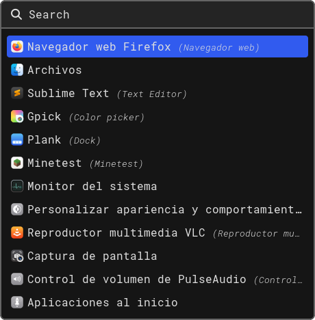

# Simple Rofi Theme

A simple theme for [rofi](https://github.com/davatorium/rofi).

## Installation

Install the theme by cloning the repository to the directory *~/.config/rofi*.

	mkdir ~/.config/rofi
	git clone https://github.com/theroneyv/simple-rofi.git ~/.config/rofi
